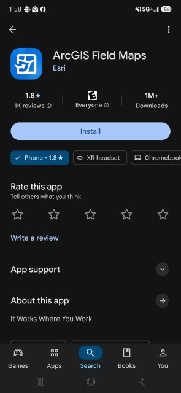
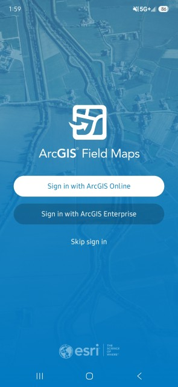
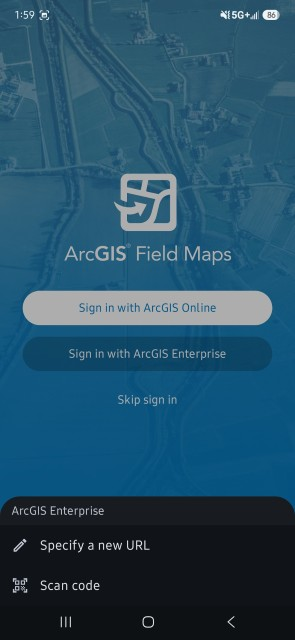
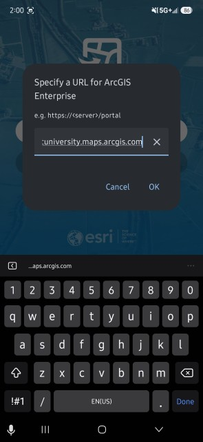
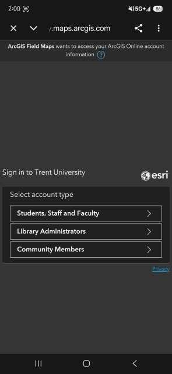
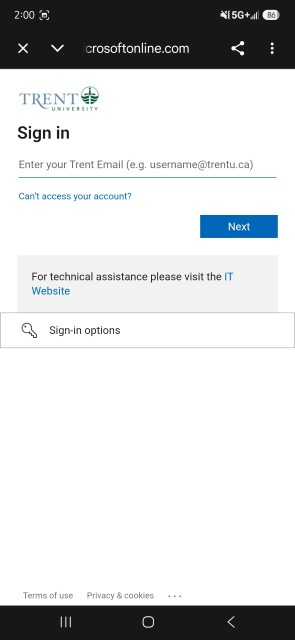
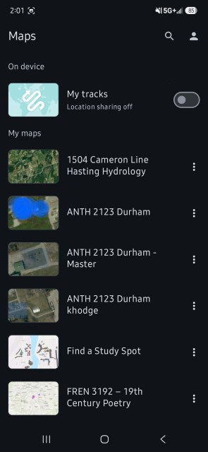

# Download ArcGIS Field Maps
1. Search for and download the "ArcGIS Field Maps" application on your mobile device from Google Play or the App Store.

2.	Choose “Sign in with ArcGIS Enterprise”

3. If it is your first time signing in, you will need to choose “Specify a new URL”.

4. Enter “trentuniversity.maps.arcgis.com”. If you have signed in before, the URL should show up as the first option. Choose this.

5. Select your user type from the options.

6. Log in using your myTrent credentials (email and password).

7. Now you have successfully logged into the Field Maps app! Your editable maps and maps shared with you will appear here.

