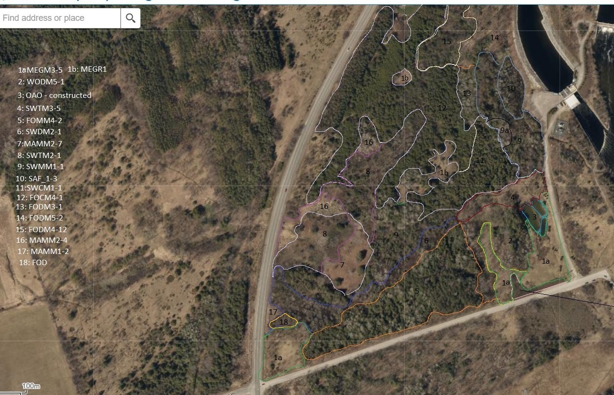

# Land Stewardship Team Data Collection Example
The Land Stewardship Team uses ArcGIS Field Maps to collect and manage ecological data across Trent's Nature Areas and University Green Network.

Previously, much of this information was collected using different methods and stored in separate locations. Today, standardized digital workflows allow observations to be:
- Georeferenced with GPS
- Stored centrally in ArcGIS Online
- Shared across stewardship, research, and teaching initiatives
- Revisited and compared over time

Here is an example of a map with the Ecosites digitized in the computer program "Paint". 

    

This map was brought into ArcGIS Pro, georeferenced, and re-digitized to create an Ecosites feature layer.

The map was uploaded to ArcGIS Online and Field Maps Designer, where a form was configured for field data collection. 

Now, the Land Stewardship team can edit the map directly in the field using the Esri Field Maps application. 

Field data collection helps the Land Stewardship Team:
- Identify environmental pressures and threats
- Monitor changes across the landscape
- Support evidence-based stewardship decisions
- Build long-term datasets for future monitoring
- Connect teaching, research, and operations through shared information

Examples of data collected:
- Road mortalities
- Invasive species observations
- Species and habitat monitoring
- Stewardship activities
